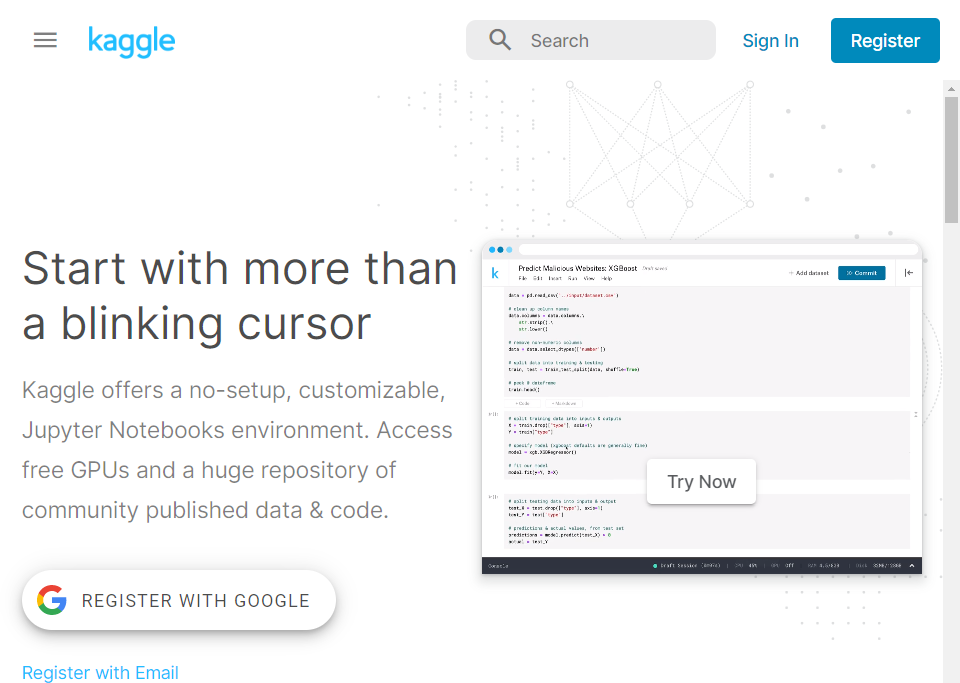
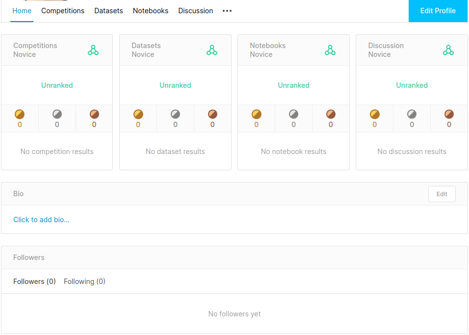

* Rev.2: 2020-08-23 (Sun)
* Rev.1: 2020-03-07 (Sat)
* Draft: 2020-03-06 (Fri)

# Level 1 - Novice in Competitions
## 캐글 홈페이지
### 회원 가입
캐글에서 활동을 하기 위한 첫 번째 미션은 [캐글 홈페이지](https://www.kaggle.com/) https://www.kaggle.com/에서 회원가입을 하는 겁니다. 캐글의 공용어는 영어입니다. 만약 영어에 익숙치 않다면, 영어를 잘 하는 친구/동료와 팀을 구성해보세요.

### My Profile
홈페이지 로그인을 해서 본 "My Profile"입니다.

회원 가입 직후에는 4개 활동영역의 레벨이 모두 Novice (입문자)입니다. 약간의 활동으로 누구나 Contributor (초급자)가 될 수 있지만, 상당량의 경기 실적이 필요한 Expert (전문가; 중급자)가 되기 위해서는 꽤 많은 시간과 노력이 요구됩니다. Master (마스터; 상급자)와 Grandmaster (그랜드마스터; 최상급자)가 되기 위해서는 오랜 시간, 많은 노력을 통해 꾸준한 성적을 내야합니다.

캐글의 활동영역(4개)과 레벨(5개)를 아래 표에 정리해봤습니다.

| 활동영역 \ 레벨 | Novice | Contributor | Expert | Master | Grandmaster |
| ------------ | ------ | ----------- | ------ | ------ | ----------- |
| Competitions |        |             |        |        |             |
| Datasets     |        |             |        |        |             |
| Notebooks    |        |             |        |        |             |
| Discussion   |        |             |        |        |             |

* 활동영역: Competitions, Datasets, Notebooks, Discussion
* 레벨: Novice, Contributor, Expert, Master, Grandmaster

## 다음

* [캐글 홈페이지 둘러보기](overview-kaggle_homepage.md)

