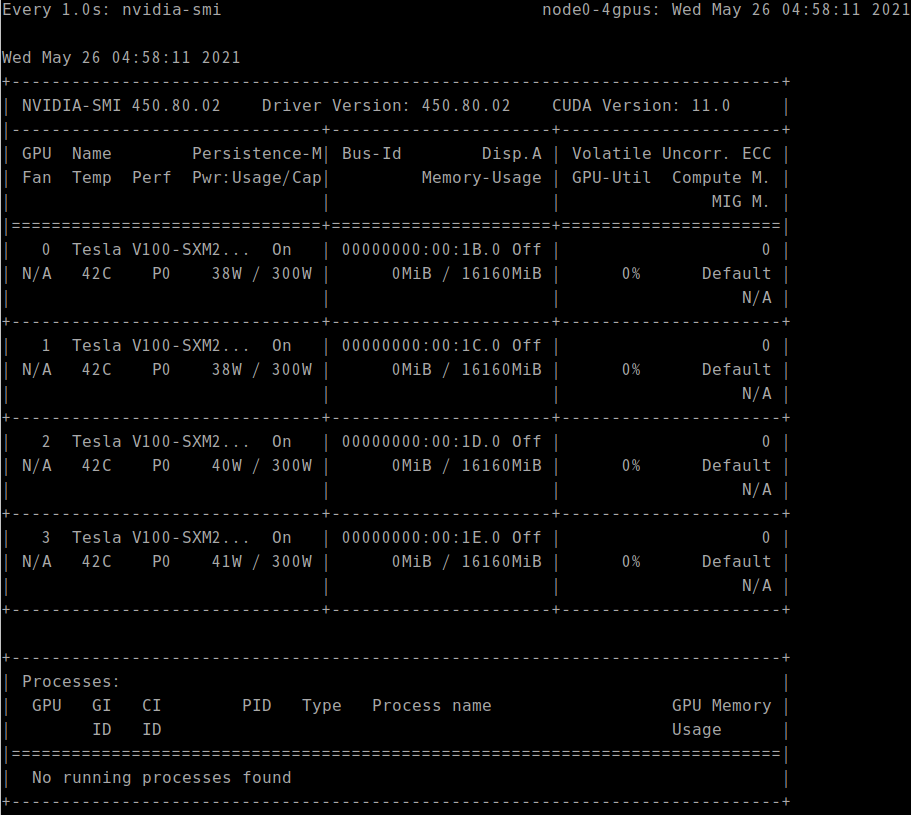
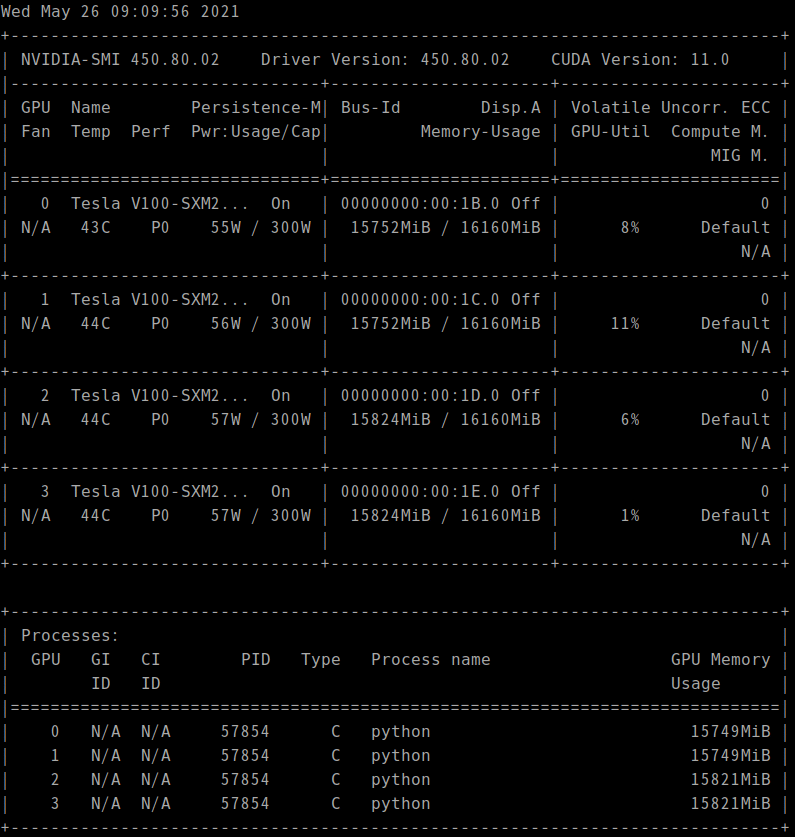

* Draft: 2021-05-25 (Tue)

# How to Run Distributed Training with Keras-MNIST CNN

## 1. Set up the computing environment

Refer to [How to Run Single-Node Multi-GPU Distributed Training with Keras/TensorFlow2](3-run_single-node_multi-gpu_distributed_computing_with_keras_tensorflow2.md)

## 2. Run the TensorFlow code

[1-distributed_training_with_keras-mnist_cnn.py](../py_files/1-distributed_training_with_keras-mnist_cnn.py) is the source code to run distributed training for TensorFlow2 which runs single-node multi-GPU simulations.

```bash
$ python 1-distributed_training_with_keras-mnist_cnn.py 
```

## 3. Monitor GPU utilization

Open another terminal and remote-access to the same EC2 instance.

```bash
(base) user@local-computer:~$ ssh -i ~/AWS_REMOTE_ACCESS/keypair.pem -L 8888:localhost:8888 -X ubuntu@1.23.456.78
ubuntu@node0-4gpus:~$
```

Observe the GPU usage with the `nvidia-smi` command.  `watch -n 1` updates the command's output every 1.0s.

```bash
$ watch -n 1 nvidia-smi
```

See the GPU utilization `GPU-Util` is 0% and `No running processes found`.



Run the TensorFlow code and observe the GPU usage together. One example is to split the terminal as follows.


The GPU utilization and processes change over time. For example,



Notice the processes are up in the bottom part and the `GPU-Util` changes over time from 0% to up to 11%.

