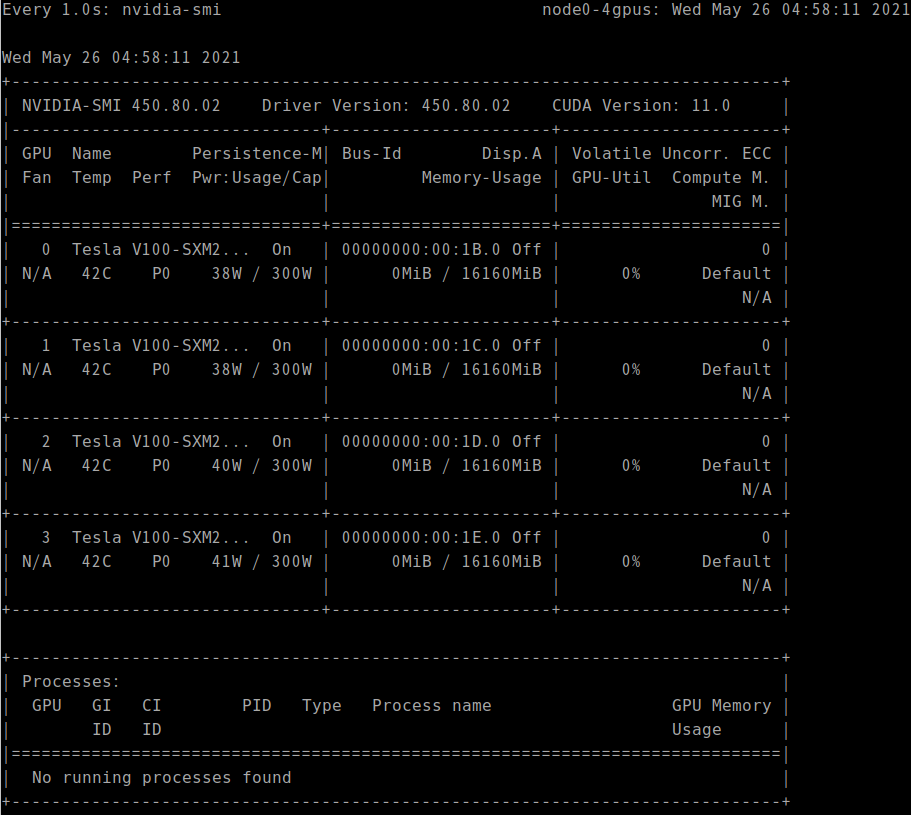
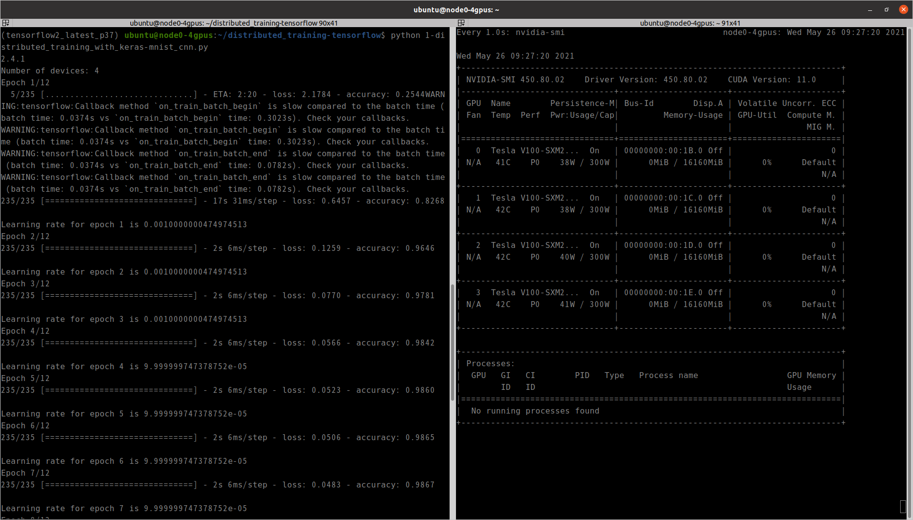
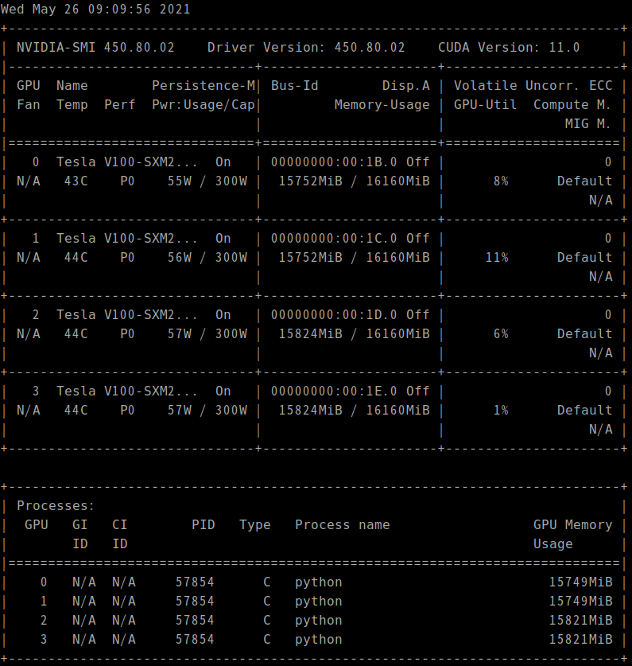

* Draft: 2021-05-25 (Tue)

# How to Run Single-Node Multi-GPU Distributed Training with Keras/TensorFlow2

## 1. Set up the computing environment

* Prepare the environment on AWS.
  * For details, refer to [How to Configure AWS for TensorFlow Distributed Computing](1-configure_aws_for_tensorflow_distributed_computing.md).
* Remote-access the prepared Amazon EC2 instance.

```bash
(base) user@local-computer:~$ ssh -i ~/AWS_REMOTE_ACCESS/keypair.pem -L 8888:localhost:8888 -X ubuntu@1.23.456.78
ubuntu@node0-4gpus:~$
```

* Activate the Conda virtual environment `tensorflow2_latest_p37`

```bash
$ conda activate tensorflow2_latest_p37
(tensorflow2_latest_p37) ubuntu@node0-4gpus:~$
```

> For simplicity, 
>
> `(tensorflow2_latest_p37) ubuntu@node0-4gpus:~$` 
>
> will be abbreviated to 
>
> `(tf2) $`

Equivalently,

```bash
(tf2) $
```

* `cd` to the project directory

```bash
(tf2) $ cd distributed_training-tensorflow/
```

## 2. Run the TensorFlow code

Run the source code in the Conda virtual environment.

```bash
(tf2) $ python <source_code_name>.py
```

For example, when <source_code_name> is :

* [1-distributed_training_with_keras-mnist_cnn.py](../py_files/1-distributed_training_with_keras-mnist_cnn.py) , run:

```bash
(tf2) $ python 1-distributed_training_with_keras-mnist_cnn.py 
```


## 3. Monitor GPU utilization

Open another terminal and remote-access to the same EC2 instance.

```bash
(base) user@local-computer:~$ ssh -i ~/AWS_REMOTE_ACCESS/keypair.pem -L 8888:localhost:8888 -X ubuntu@1.23.456.78
ubuntu@node0-4gpus:~$
```

Observe the GPU usage with the `nvidia-smi` command.  `watch -n 1` updates the command's output every 1.0s.

```bash
$ watch -n 1 nvidia-smi
```

See the GPU utilization `GPU-Util` is 0% and `No running processes found`.



Run the TensorFlow code and observe the GPU usage together. One example is to split the terminal as follows.



The GPU utilization and processes change over time. For example,



Notice the processes are up in the bottom part and the `GPU-Util` changes over time from 0% to up to 11%.

