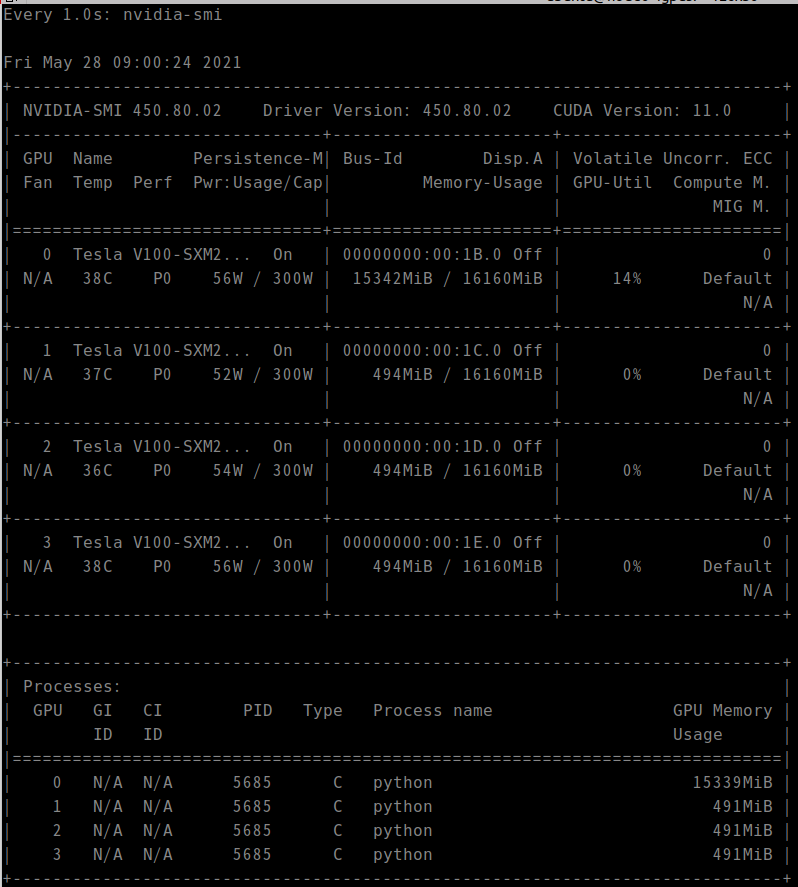
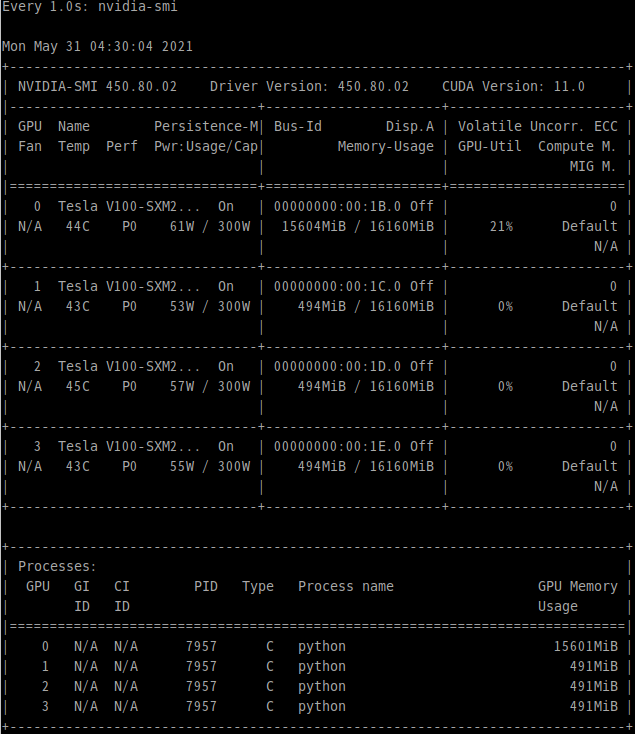
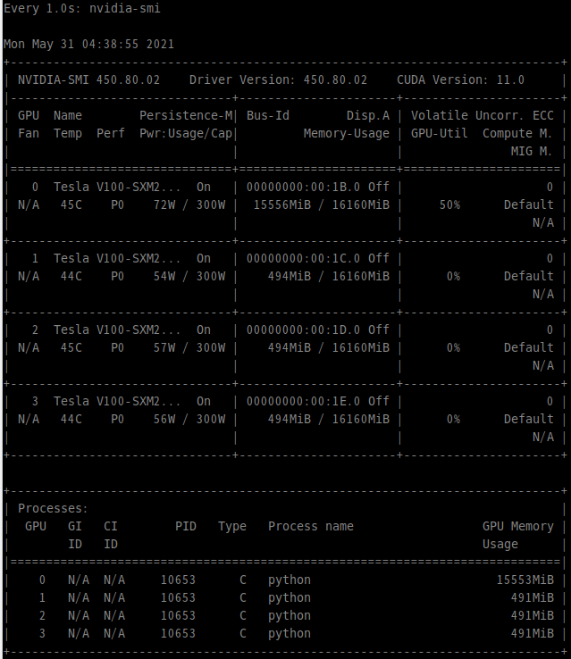

* Draft: 2021-05-28 (Fri)

# Hands-on: Single Device Simulations

## 2_mnist-mlp-keras.py 

```bash
$ python 2_mnist-mlp-keras.py
```

Refer to [Full Ouput Messages](full_output_messages.md)

GPU-Util <= 14% on NVIDIA V100

Execution time

```bash
real	0m30.453s
user	0m22.780s
sys	    0m7.558s
```




## 2_mnist-simple-cnn-keras.py

```bash
$ python 2_mnist-simple-cnn-keras.py
```

Refer to [Full Ouput Messages](full_output_messages.md).

GPU-Util <= 21% on NVIDIA V100

Execution time

```bash
real	1m46.381s
user	2m24.027s
sys	    0m20.869s
```




The screen capture is omitted below.

## 3_mnist-cnn-keras.py

```bash
$ python 3_mnist-cnn-keras.py
```

Refer to [Full Ouput Messages](full_output_messages.md).

GPU-Util <= 34~35% on NVIDIA V100

Execution time

```bash
real	0m32.027s
user	0m41.547s
sys	    0m11.995s
```

## 4_fashion_mnist-cnn-keras.py

```bash
$ python 4_fashion_mnist-cnn-keras.py
```

Refer to [Full Ouput Messages](full_output_messages.md).

GPU-Util <= 34~36% on NVIDIA V100

Execution time

```bash
real	0m32.855s
user	0m41.966s
sys	    0m11.831s
```

## 5_cifar10-cnn-keras-tf2.py

`5_cifar10-cnn-keras.py` is made for the old version of Keras. Running it fails with an error.


The source code is modified for TensorFlow2 and saved in `5_cifar10-cnn-keras-tf2.py`. Notice the `-tf2` in the file name.

```bash
$ python 5_cifar10-cnn-keras-tf2.py
```

 Refer to [Full Ouput Messages](full_output_messages.md).

GPU-Util <= 40% on NVIDIA V100

Execution time

```bash
real	0m36.497s
user	0m49.629s
sys	    0m14.929s
```


## 6_imdb_movie_review-bidirectional_lstm-keras.py

```bash
$ python 6_imdb_movie_review-bidirectional_lstm-keras.py
```

Refer to [Full Ouput Messages](full_output_messages.md).

GPU-Util <=46~55% on NVIDIA V100

Execution time

```bash
real	4m29.491s
user	7m52.585s
sys	    0m30.846s
```




## 7_reuters_newswire-mlp-keras-tf2.py

Note the original Keras code fails with `ModuleNotFoundError`.

```bash
$ python 7_reuters_newswire-mlp-keras.py
Traceback (most recent call last):
  File "7_reuters_newswire-mlp-keras.py", line 43, in <module>
    from keras 		   import models
ModuleNotFoundError: No module named 'keras'
$
```

This code is changed for TensorFlow2.0 as follows.

Basically, `from keras` is replaced with `from tensorflow.keras`.

```bash
$ python 7_reuters_newswire-mlp-keras-tf2.py
```

Refer to [Full Ouput Messages](full_output_messages.md).

GPU-Util <= 84% on NVIDIA V100

Execution time

```bash
real	0m10.479s
user	0m11.752s
sys	    0m7.912s
```

