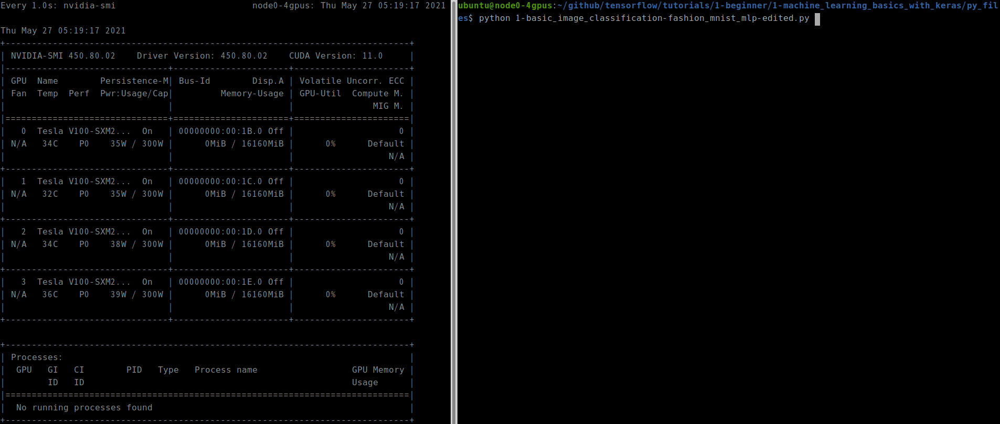
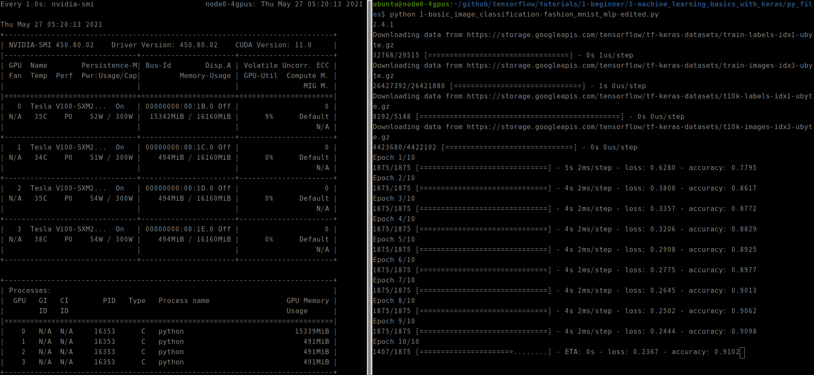
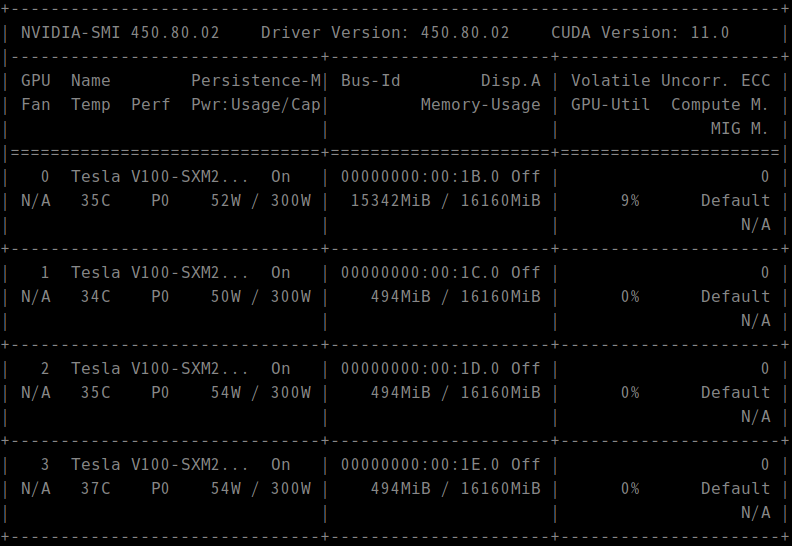
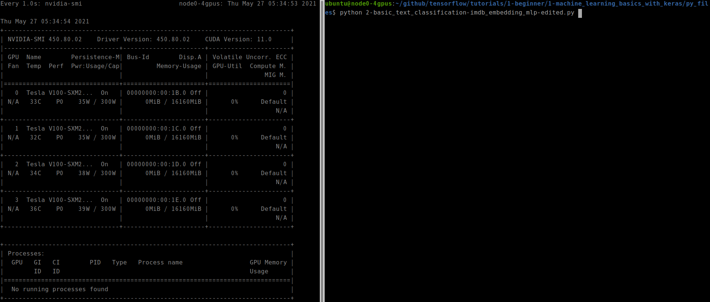
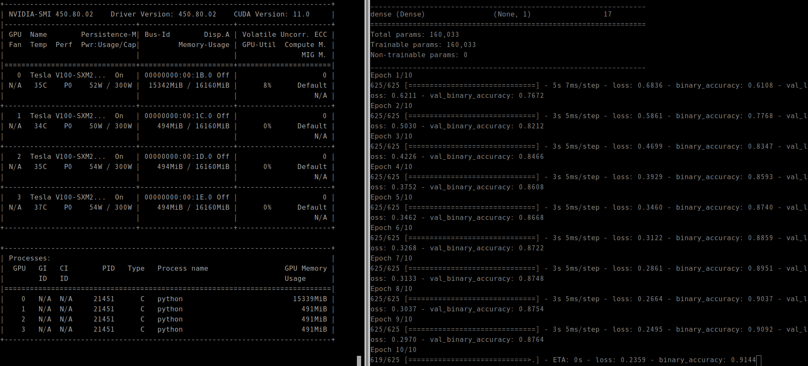

* Draft: 2021-05-27 (Thu)
# github.com/aimldl/tensorflow/tutorials/1-beginner/1-machine_learning_basics_with_keras

## 1-basic_image_classification-fashion_mnist_mlp-edited
### Run the code
```bash
$ cd py_files/
$ python 1-basic_image_classification-fashion_mnist_mlp-edited.py 
```
Refer to the full output message at [Appendix. Full Output Messages](APPENDIX.md).

### Check the GPU utilization.
Open another terminal and observe the GPU utilization.
```bash
$ watch -n 1 nvidia-smi
```
#### Before


#### After: at 10/10 epoch


### Memo
The maximu GPU utilization is 9% on my Amazon EC2 instance with NVIDIA V100 GPU.



## 2-basic_text_classification-imdb_embedding_mlp
### Run the code
```bash
$ cd py_files/
$ python 2-basic_text_classification-imdb_embedding_mlp-edited.py
```
Refer to the full output message at [Appendix. Full Output Messages](APPENDIX.md).

### Check the GPU utilization.
Open another terminal and observe the GPU utilization.
```bash
$ watch -n 1 nvidia-smi
```
#### Before


#### After: at 10/10 epoch


#### Memo
When GPU is used, the output should look like this. On NVIDIA V-100, the GPU utilization is less than 10%.
<src img='images/python_2-2-basic_text_classification-imdb_embedding_mlp-edited_py-watch_-n_1_nvidia-smi.gif'>


